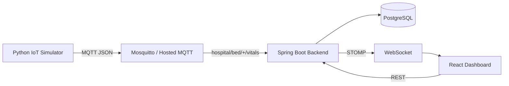

# IoT Multi-Patient Vital Sign Monitoring & Alert System

A production-structured, MVP-sized IoT portfolio project that simulates four hospital patient-monitoring devices, publishes vital readings over MQTT, processes them with Spring Boot, persists readings and alerts in PostgreSQL, and streams live bed/alert updates to a React dashboard using WebSocket + STOMP.

> **Demo/medical disclaimer:** The patients and readings are synthetic. The alert thresholds are used only for simulation/demo purposes and are **not clinical decision rules**.

## 1. Overview

The system demonstrates a complete IoT-to-web pipeline:



## 2. Features

- Four simulated patient beds: BED-01 through BED-04
- Heart rate, SpO2, temperature and blood pressure
- Approximately 2-second MQTT publishing interval
- Normal/warning/critical demo states
- Automatic alert creation
- One active alert per bed + vital type
- Alert resolution when the vital recovers
- Alert history preserved in PostgreSQL
- REST APIs for beds and alerts
- WebSocket/STOMP live updates
- Automatic MQTT reconnect attempts
- React dashboard with live connection state
- Responsive desktop/tablet/mobile layout
- Docker Compose local environment
- Environment-variable-based configuration
- Cloud-ready separation of frontend, backend, database, MQTT broker and simulator

## 3. Tech Stack

### Backend
- Java 17
- Spring Boot
- Spring Web
- Spring Data JPA / Hibernate
- PostgreSQL
- Eclipse Paho MQTT client
- Spring WebSocket + STOMP
- Jackson

### Frontend
- React
- Vite
- JavaScript
- @stomp/stompjs
- CSS

### Simulator
- Python 3.11+
- paho-mqtt

### Infrastructure
- Docker
- Docker Compose
- Mosquitto
- PostgreSQL container

## 4. Project Structure

```text
vital-monitoring-system/
├── backend/
│   ├── Dockerfile
│   ├── pom.xml
│   └── src/main/
│       ├── java/com/saksham/vitalmonitoring/
│       │   ├── VitalMonitoringApplication.java
│       │   ├── config/
│       │   ├── mqtt/
│       │   ├── model/
│       │   ├── entity/
│       │   ├── repository/
│       │   ├── service/
│       │   ├── dto/
│       │   └── controller/
│       └── resources/application.properties
├── simulator/
├── frontend/
├── mosquitto/
├── docker-compose.yml
├── .env.example
├── .gitignore
└── README.md
```

## 5. Data Flow

1. Python creates a synthetic reading for each bed.
2. It publishes JSON to `hospital/bed/{bedId}/vitals`.
3. Spring Boot subscribes to `hospital/bed/+/vitals`.
4. `MqttListener` deserializes the JSON and delegates to `VitalProcessingService`.
5. The service finds the patient, updates in-memory current state and persists a `VitalReading`.
6. Each vital is evaluated against the demo thresholds.
7. `AlertService` creates, updates or resolves alerts without creating duplicates.
8. The backend calculates overall bed status, where CRITICAL has priority over WARNING.
9. A `BedStatusResponse` is sent to `/topic/vitals`.
10. New/resolved alerts are sent to `/topic/alerts`.
11. React updates the matching bed card and active-alert panel without refreshing.

## 6. MQTT Topic Structure

```text
hospital/bed/BED-01/vitals
hospital/bed/BED-02/vitals
hospital/bed/BED-03/vitals
hospital/bed/BED-04/vitals
```

Backend subscription:

```text
hospital/bed/+/vitals
```

Example payload:

```json
{
  "bedId": "BED-01",
  "heartRate": 82,
  "spo2": 98,
  "temperature": 36.8,
  "systolic": 120,
  "diastolic": 80,
  "timestamp": "2026-09-03T23:50:00"
}
```

## 7. Database Schema

### patients

- `id` - generated primary key
- `name`
- `age`
- `bed_id` - unique, non-null

The application automatically seeds four patients if their beds do not already exist.

### vital_readings

- `id`
- `patient_id` - many-to-one relationship to patients
- `heart_rate`
- `spo2`
- `temperature`
- `systolic`
- `diastolic`
- `timestamp`

Every accepted MQTT reading is persisted.

### alerts

- `id`
- `patient_id`
- `bed_id`
- `vital_type`
- `value`
- `threshold`
- `severity`
- `status`
- `created_at`
- `resolved_at`

Resolved records are deliberately retained as history.

## 8. Alert Logic

These rules exist only to demonstrate the engineering workflow and are not medical guidance.

| Vital | Rule | Severity |
|---|---|---|
| Heart rate | `>120` | CRITICAL |
| Heart rate | `<50` | CRITICAL |
| SpO2 | `<92` | CRITICAL |
| SpO2 | `92-94` | WARNING |
| Temperature | `>38.0` | WARNING |
| Blood pressure | systolic `>140` OR diastolic `>90` | WARNING |
| Normal recovery | back within configured safe range | resolve active alert |

Overall bed status:

1. Any CRITICAL alert -> `CRITICAL`
2. Otherwise any WARNING alert -> `WARNING`
3. Otherwise -> `NORMAL`

### Duplicate prevention

There can be only one active alert for a given `bed + vitalType`.

Example:

```text
10:00 HR 145 -> create alert 10
10:02 HR 148 -> update alert 10, do not create alert 11
10:05 HR 80  -> resolve alert 10
10:20 HR 150 -> create new alert 11
```

## 9. Local Setup

### Prerequisites

- Docker Desktop
- Docker Compose
- Node.js 20+ if running frontend outside Docker
- Java 17+ and Maven if running backend outside Docker
- Python 3.11+ if running simulator outside Docker

### Start the full local stack

1. Copy `.env.example` to `.env`.
2. From the repository root run:

```bash
docker compose up --build
```

This starts:

- PostgreSQL on `localhost:5432`
- Mosquitto on `localhost:1883`
- Spring Boot on `localhost:8080`
- React/nginx on `localhost:5173`
- Python simulator as a continuously running container

Open the dashboard at:

```text
http://localhost:5173
```

Health check:

```text
http://localhost:8080/api/health
```

## 10. Environment Variables

### Backend

```text
DATABASE_URL
DATABASE_USERNAME
DATABASE_PASSWORD
MQTT_BROKER_URL
MQTT_PORT
MQTT_USERNAME
MQTT_PASSWORD
FRONTEND_URL
PORT
```

### Frontend

```text
VITE_API_URL
VITE_WS_URL
```

For a production frontend, use an HTTPS API URL and a secure WebSocket URL:

```text
VITE_API_URL=https://your-backend.example.com
VITE_WS_URL=wss://your-backend.example.com/ws
```

### Simulator

```text
MQTT_BROKER_URL
MQTT_PORT
MQTT_USERNAME
MQTT_PASSWORD
```

Never commit `.env` files or production credentials.

## 11. Docker Setup

The Compose network intentionally uses service names inside containers:

```text
backend -> postgres:5432
backend -> mosquitto:1883
simulator -> mosquitto:1883
```

Do not change these internal addresses to `localhost` inside Docker.

PostgreSQL uses the named volume `postgres_data`, so restarting containers does not delete the database.

The Mosquitto configuration is deliberately permissive for local development only. Production must use an authenticated hosted MQTT broker, ideally over TLS.

## 12. REST API Endpoints

| Method | Endpoint | Purpose |
|---|---|---|
| GET | `/api/beds` | Current state of all beds |
| GET | `/api/beds/{bedId}` | Current state of one bed |
| GET | `/api/alerts` | Full alert history, newest first |
| GET | `/api/alerts/active` | Active alerts |
| GET | `/api/alerts/bed/{bedId}` | Alert history for a bed |
| GET | `/api/health` | Simple application health response |

The API returns DTOs instead of exposing JPA entities directly.

## 13. WebSocket Topics

STOMP endpoint:

```text
/ws
```

Subscriptions:

```text
/topic/vitals
/topic/alerts
```

A vital update replaces the matching bed in React. An ACTIVE alert is inserted/updated in the active list. A RESOLVED alert is removed from the active list while remaining available in alert history.

## 14. Simulator

The simulator models four devices and publishes approximately every two seconds.

The demo state distribution is approximately:

- 80% NORMAL
- 15% WARNING
- 5% CRITICAL

Each abnormal mode persists for several readings so a recruiter can actually see the alert state before the simulator recovers or changes mode.

Example log:

```text
BED-01 -> HR:82 | SpO2:98 | Temp:36.8 | BP:120/80 | NORMAL
```

The simulator runs indefinitely and can be deployed as a long-running worker.

## 15. Manual Emergency Test

With the backend and MQTT broker running, publish this message to:

```text
hospital/bed/BED-02/vitals
```

Payload:

```json
{
  "bedId": "BED-02",
  "heartRate": 145,
  "spo2": 88,
  "temperature": 39.2,
  "systolic": 155,
  "diastolic": 98,
  "timestamp": "2026-09-03T23:50:00"
}
```

Expected result:

```text
BED-02 -> CRITICAL
```

and multiple active alerts are generated, one per abnormal vital type.

Recovery payload:

```json
{
  "bedId": "BED-02",
  "heartRate": 78,
  "spo2": 98,
  "temperature": 36.8,
  "systolic": 120,
  "diastolic": 80,
  "timestamp": "2026-09-03T23:51:00"
}
```

Expected result: active alerts are resolved and their `resolvedAt` timestamps are stored.

For example, using a local Mosquitto client:

```bash
mosquitto_pub -h localhost -p 1883 \
  -t 'hospital/bed/BED-02/vitals' \
  -m '{"bedId":"BED-02","heartRate":145,"spo2":88,"temperature":39.2,"systolic":155,"diastolic":98,"timestamp":"2026-09-03T23:50:00"}'
```

## 16. Cloud Deployment

The codebase is separated so each component can move to a managed platform without source changes.

### Frontend - Vercel

Deploy `frontend/` as a Vite application.

Set:

```text
VITE_API_URL=https://your-backend.example.com
VITE_WS_URL=wss://your-backend.example.com/ws
```

### Backend - Render or another Docker platform

Deploy `backend/Dockerfile`.

Set:

```text
DATABASE_URL=jdbc:postgresql://...
DATABASE_USERNAME=...
DATABASE_PASSWORD=...
MQTT_BROKER_URL=...
MQTT_PORT=...
MQTT_USERNAME=...
MQTT_PASSWORD=...
FRONTEND_URL=https://your-frontend.example.com
PORT=8080
```

If the platform provides a dynamic `PORT`, keep `PORT` set to that platform value.

### Database - Managed PostgreSQL

Use the provider's host, database name, username and password in the backend environment variables. Do not put these values into Java source code.

### MQTT - Hosted authenticated broker

Use a hosted MQTT provider with authentication and TLS. Configure its broker URL, port, username and password through environment variables.

### Simulator - Background Worker

Deploy `simulator/` as a long-running worker/container and point it at the hosted MQTT broker. It should not be deployed as a short-lived web service.

### Production flow

```text
Python Worker
    |
    | MQTT/TLS
    v
Hosted MQTT Broker
    |
    v
Cloud Spring Boot API
    |
    +---- Managed PostgreSQL
    |
    +---- WebSocket/STOMP
              |
              v
        Vercel React UI
```

No source-code changes should be necessary between local and production; configuration changes through environment variables are expected.

## 17. Limitations

- No authentication/authorization; intentionally omitted for this portfolio MVP.
- No Redis, Kafka, Kubernetes or microservice split; the workload does not need them at this stage.
- Current vitals are kept in an in-memory `ConcurrentHashMap`, so they are repopulated when new MQTT readings arrive after a backend restart.
- PostgreSQL history is persistent, but no historical vital-chart API is included in this MVP.
- Alert thresholds are synthetic demo rules and must not be used for real clinical decisions.
- Local Mosquitto allows anonymous connections; this is not a production security configuration.

## 18. Future Improvements

- Authentication and role-based access
- Patient admission/discharge management
- Historical vital trend charts
- Device heartbeat and offline-device detection
- MQTT TLS/certificate management
- Message validation/schema versioning
- Database migrations with Flyway
- Automated tests and integration tests
- Observability with metrics, structured logs and tracing
- Production-grade broker clustering and durable messaging where required


